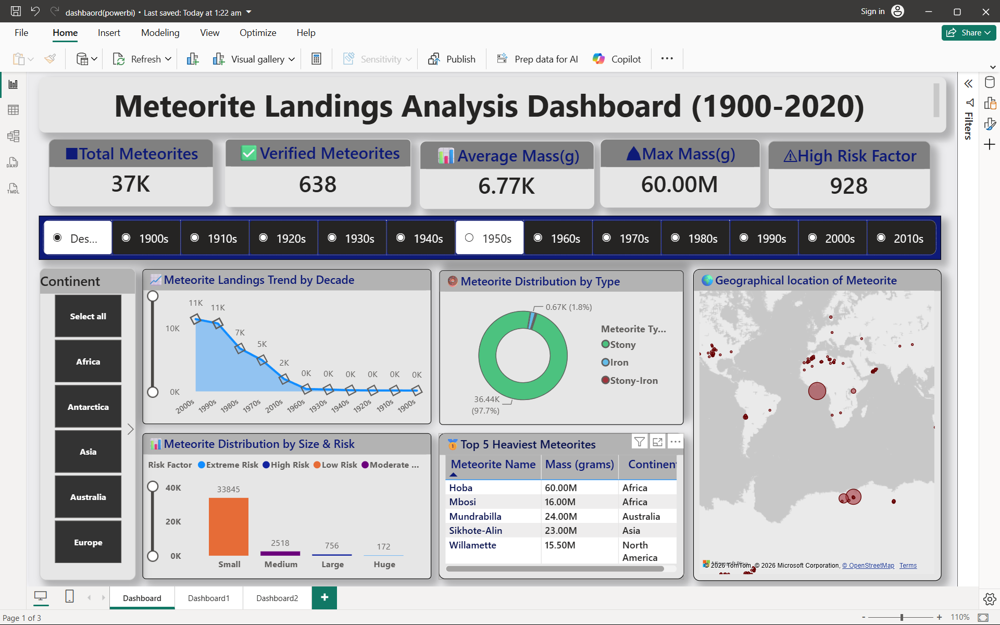
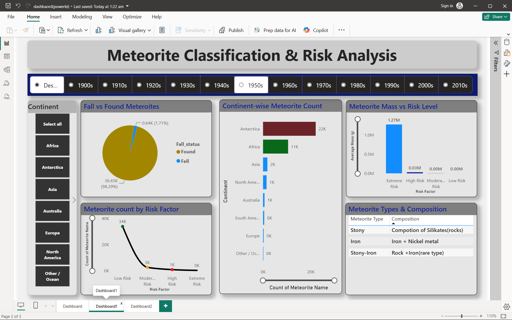

# ☄️ Meteorite Landings Analysis Dashboard (1900–2020)

An interactive Power BI dashboard built using the NASA Meteorite Landings dataset to analyze global meteorite distribution, temporal trends, meteorite classification, and mass-based risk assessment through dynamic visualizations and DAX.

---

## 📌 Project Overview

This project transforms historical meteorite landing data into an interactive analytical dashboard. It helps users explore meteorite occurrences across geography, time, mass categories, and meteorite types using Power BI.

The dashboard is designed to provide meaningful insights through KPIs, maps, charts, slicers, and DAX-based calculations.

---

## 📷 Dashboard Preview

### Dashboard Page 1
> *(Add `Images/dashboard_page1.png` here)*



---

### Dashboard Page 2
> *(Add `Images/dashboard_page2.png` here)*



---

# 🎯 Project Objectives

- Analyze global distribution of meteorite landings.
- Study meteorite trends across different decades.
- Classify meteorites based on mass and risk level.
- Evaluate meteorite composition and type distribution.
- Identify high-risk and extreme meteorite events.
- Enable interactive analysis using dynamic slicers and KPIs.

---

# 📊 Dashboard Features

### 📈 KPI Cards

- Total Meteorites
- Verified Meteorites
- Average Mass (g)
- Maximum Mass (g)
- High Risk Meteorites

---

### 🌍 Interactive Visualizations

- World Map
- Meteorite Landing Trend by Decade
- Meteorite Distribution by Type
- Meteorite Distribution by Size & Risk
- Top 5 Heaviest Meteorites
- Risk Analysis Dashboard
- Interactive Decade Slicer

---

# 🧹 Data Preprocessing

The dataset was cleaned and prepared before visualization by:

- Removing records with missing values in important columns.
- Renaming columns for better readability.
- Correcting data types.
- Filtering invalid year values.
- Creating analytical columns using DAX.

### DAX Calculated Columns

- Decade
- Continent
- Mass Category
- Meteorite Type Group
- Risk Factor

---

# 📐 DAX Measures

The dashboard includes custom DAX measures such as:

- Total Meteorites
- Verified Meteorites
- Average Mass
- Maximum Mass
- High Risk Meteorite Count

---

# 🛠️ Tools & Technologies

- Microsoft Power BI
- Power Query
- DAX (Data Analysis Expressions)
- Microsoft Excel / CSV
- Git & GitHub

---

# 📂 Project Structure

```
Meteorite-Landings-PowerBI-Dashboard
│
├── Dashboard
│   └── dashboard(powerbi).pbix
│
├── Dataset
│   └── meteorite_landings.csv
│
├── Images
│   ├── dashboard_page1.png
│   └── dashboard_page2.png
│
├── Report
│   └── Dashboard Report.pdf
│
└── README.md
```

---

# 📊 Key Insights

- Meteorite landings are unevenly distributed across different regions.
- Meteorite records increase significantly in recent decades.
- Small and medium meteorites are the most common.
- Large and extreme meteorites are rare but contribute most to risk.
- Stony meteorites dominate the dataset.
- Mass is a strong indicator of meteorite risk.

---

# 🚀 How to Use

1. Clone the repository.

```
git clone https://github.com/yourusername/Meteorite-Landings-PowerBI-Dashboard.git
```

2. Open the `.pbix` file in Microsoft Power BI Desktop.

3. Load the dataset if prompted.

4. Interact with the dashboard using the Decade slicer.

---

# 📁 Dataset

**Source:** NASA Open Data – Meteorite Landings Dataset

https://www.kaggle.com/datasets/nasa/meteorite-landings

---

# 📖 Report

The complete project report is available in the `Report` folder.

---

# 👨‍💻 Author

**Neeraj Chauhan**

B.Tech – Computer Science Engineering

GitHub: https://github.com/yourusername

LinkedIn: https://linkedin.com/in/yourprofile

---

## ⭐ If you found this project useful, consider giving it a Star!